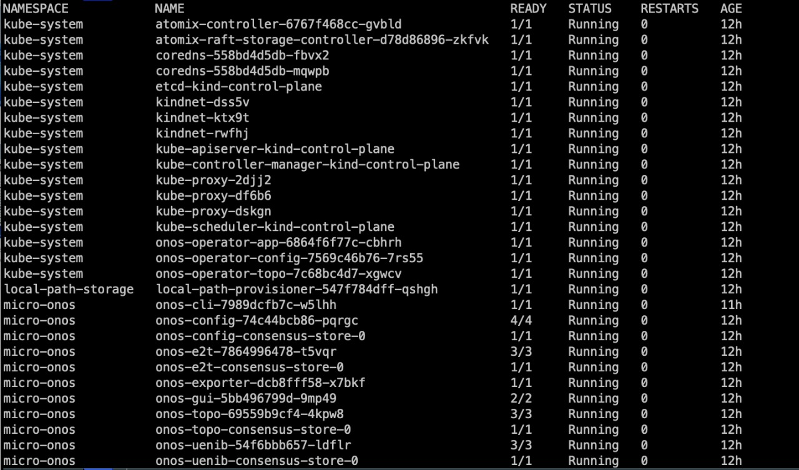

# ONOS Implementation
## Bootstrap **ONOS nRT-RIC** setup 
### Prerequisite
- Linux machine (ubuntu 18.04 LTS preferebly )
- go 
- helm 
- kubectl 
- docker


## Kind Cluster 
### Create a cluster 
```
kind create cluster --config config.yml
```
### setup the kubeconfig
```
kind get kubeconfig > ~/.kube/kind
```

### Create namespace 
```
kubectl create namespace micro-onos
```

## Install ONOS and its depenedencies 

### Setting up helm repo 
```
helm repo add cord https://charts.opencord.org
helm repo add atomix https://charts.atomix.io
helm repo add onosproject https://charts.onosproject.org
helm repo update
```
### Installing helm charts 
```
helm install -n kube-system atomix-controller atomix/atomix-controller
helm install -n kube-system atomix-raft-storage atomix/atomix-raft-storage
helm install -n kube-system onos-operator onosproject/onos-operator
```
### Installing onus-umbrella applications

#### Set context 
```
kubectl config set-context --current --namespace=micro-onos
```
#### onos-gui installation

```
cd onos-gui
helm install onos-gui .
cd ..
```
#### onos-topo installation

```
cd onos-topo
helm install onos-topo .
cd ..
```

#### onos-topo installation

```
cd onos-config
helm install onos-config .
cd ..
```

#### onos-uenib

```
cd onos-uenib/
helm install onos-uenib .
cd ..
```

#### onos-e2t

```
cd onos-e2t/
helm install onos-e2t .
cd ..
```

#### ran-simulator

```
cd ran-simulator/
helm install ran-simulator .
cd ..
```

#### onos-exporter

```
cd onos-exporter/
helm install onos-exporter .
cd ..
```

### Validate if all pods are ruuning 
```
kubectl -n micro-onos get pods
```
### Namespace 


### Pods in kubesystem namespace 


### Pods Running in micro-onos namespace



